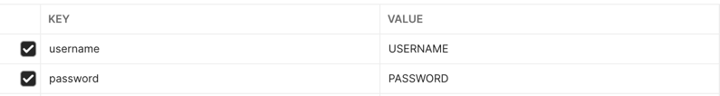

# Test URL Shortener

## [Live demo](https://976g3d.deta.dev/api/docs)

## Installation

Clone this repository, after that run this command to build containers.
```bash
docker-compose build
```

## Run
Run this command in project folder to start containers.
```bash
docker-compose up -d
```

## Functions

The API documentation is at this link
```url
http://localhost:8000/api/docs
```

## Testing by using Postman

#### 1. Register account

URL
```url
http://localhost:8000/api/auth/register
```
POST request with json body
```json
{
  "username": "USERNAME",
  "password": "PASSWORD",
  "confirm_password": "CONFIRM PASSWORD"
}
```

#### 2. Login in to account
URL
```url
http://localhost:8000/api/auth/login
```
POST request with form-data

Response with JWT token
```json
{
  "access_token": "TOKEN",
  "token_type": "bearer"
}
```

#### 3. Create url

Only authenticated users can create url

URL
```url
http://localhost:8000/
```
POST request with json body
```json
{
  "url": "https://www.google.com/",
  "days": 5
}
```
Response with short url code
```json
{
  "msg": "Successfully created.",
  "code": "CODE"
}
```
#### 4. Test redirect route
GET method with code parameter
```url
http://localhost:8000/{code}
```
